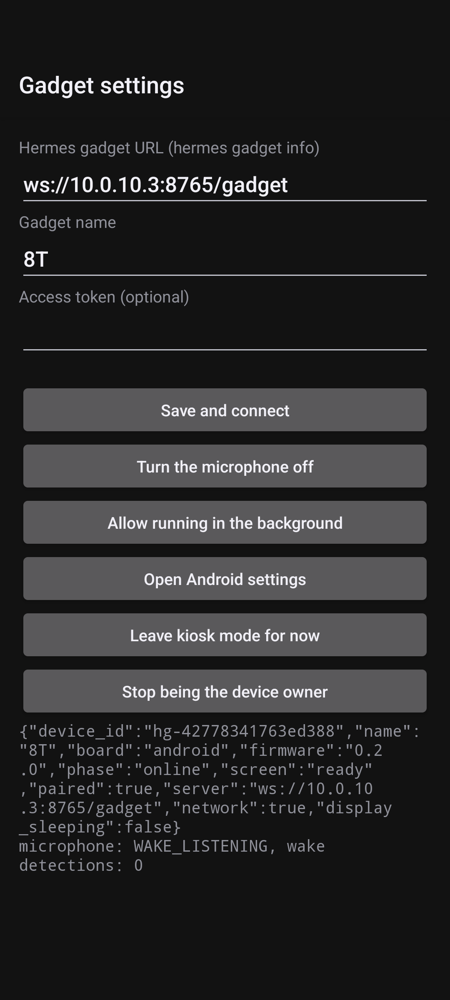
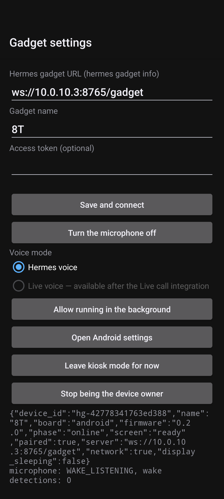
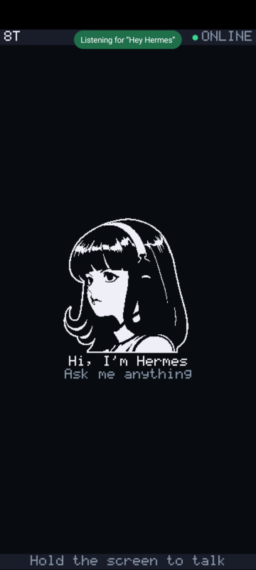
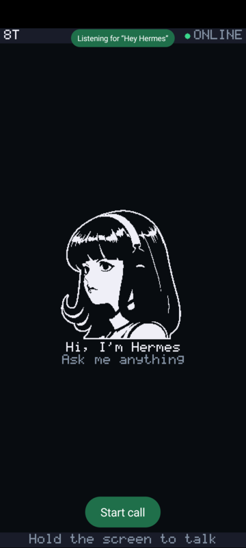
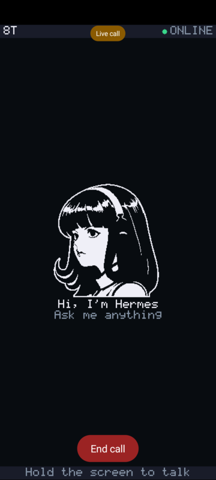
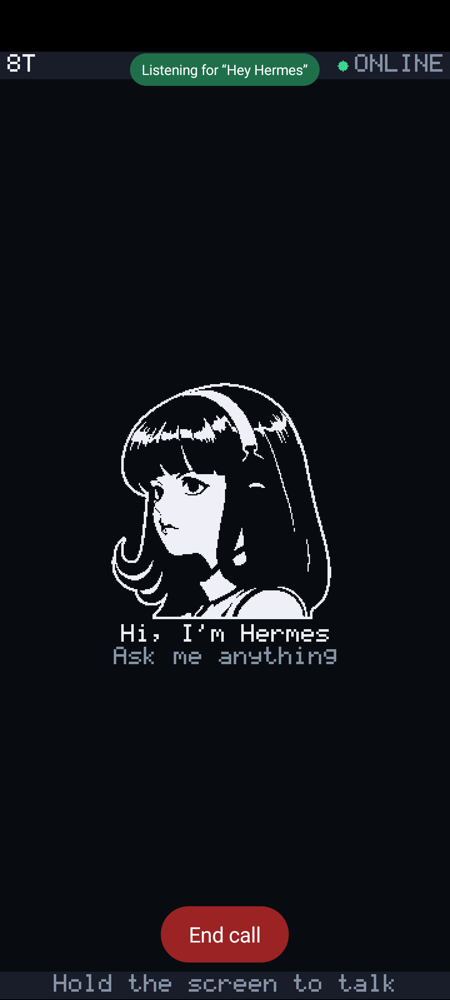
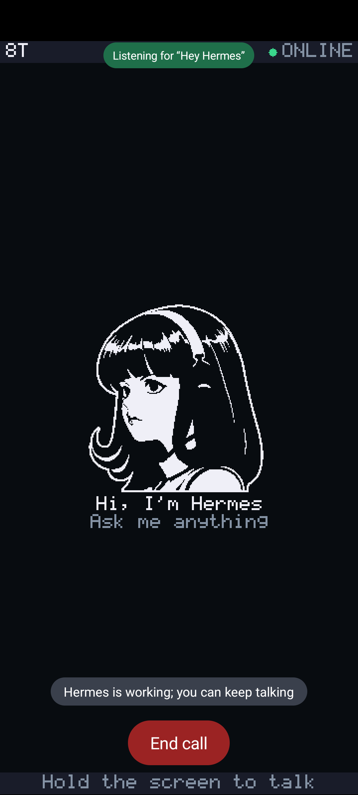

# Hardware capabilities and verification

The Raspberry Pi 4/5 Linux port is experimental. ARM64 CI covers the native
core, service, package installation and updates. USB audio, GPIO, and display
tests use software drivers or test doubles. No physical Pi report is recorded.

The Android client is experimental. CI builds the app and runs the device core
through its JNI bridge on the build machine, with test doubles for the drivers;
its wake tests run the real wake models with the TensorFlow Lite C library.
Physical reports record [wake listening](#oneplus-8t-wake-listening-report),
[Hermes voice requests](#oneplus-8t-hermes-voice-checks),
[Live calls](#oneplus-8t-live-call-checks) and their
[echo and interruption](#oneplus-8t-echo-and-interruption-checks), and
[Live task handoffs](#oneplus-8t-live-task-handoffs) on a OnePlus 8T.
They do not cover the rest of the physical checklist.

Firmware builds and simulator tests check software behavior. A physical verification report records what worked on a particular board revision, wiring, and firmware commit. A passing build alone does not establish that a microphone, power circuit, or display works on a device.

## Current hardware

| Model | Display and input | Audio | Power support | Verification |
|---|---|---|---|---|
| ESP32-S3-DevKitC-1 N8R8 breadboard | Wired ST7789, TALK and CANCEL buttons | Wired I2S microphone; optional MAX98357A speaker | External power | CI build; physical report not recorded |
| Waveshare ESP32-S3-LCD-1.54, SKUs 33866/33867 | ST7789 240×240; BOOT and PLUS | ES7210 microphones and ES8311 speaker | Calibrated voltage, charging signal, battery latch and screen timeout; USB bypasses shutdown | CI build; physical report not recorded |
| Waveshare ESP32-S3-Touch-AMOLED-1.75 | CO5300 466×466; CST9217 touch, BOOT and PWR | ES7210 microphones and ES8311 speaker output | AXP2101 readings and local power-off; optional screen timeout | CI build; physical report not recorded |
| Waveshare ESP32-S3-Touch-AMOLED-1.75C, SKUs 33691/33692 | CO5300 466×466; CST9217 touch and BOOT | ES7210 microphones and ES8311 onboard speaker | AXP2101 readings, audio supply and local power-off; screen timeout | Experimental; physical report not recorded |
| Waveshare ESP32-S3-Touch-AMOLED-1.8, V2 only | CO5300 368×448; CST820 touch and BOOT | ES8311 analog microphone and speaker output | AXP2101 readings and local power-off; display/touch reset through a TCA9554 expander | Experimental; physical smoke check only (boot, display, I2C devices present, codecs and the touch, speaker and microphone tasks start); touch, microphone capture, speaker playback and battery not verified; full checklist not completed |
| Waveshare ESP32-S3-Touch-LCD-1.85C V2 / PCB Rev2.0 only | ST77916 360×360 round QSPI LCD; CST816 touch and BOOT | ES8311 + ES7210 dual analog mic slots, NS4150B PA; mono transport; no software AEC | USB/battery switch; screen timeout; no battery telemetry or software shutdown | Experimental; [partial Rev2.0 report](#waveshare-185c-v2-partial-physical-report); full checklist not completed |
| Xorigin AIPI Lite | ST7789 128×128; BOOT and power keys | One ES8311 for speaker and microphone | GPIO 10 power latch and power-off; battery level and charging not reported | Experimental; contributor smoke test on an earlier revision (boot, display and audio start, online pairing); microphone capture, colors, USB console and battery not verified on this revision |
| Espressif ESP32-S3-BOX-3 | ST7789/TT21100 or ILI9342/GT911, detected through I2C; BOOT and touch gestures | ES7210 microphones and ES8311 onboard speaker | USB power; screen timeout | Experimental; physical report not recorded for either panel revision |
| M5Stack CoreS3 (K128) | ILI9342C/E 320×240, detected through touch firmware; FT6336 gestures | ES7210 microphones and AW88298 speaker | AXP2101 readings, backlight and local power-off; AW9523 reset/boost control | Experimental; physical report not recorded for either panel revision |
| LilyGO T-Display-S3 (SKU/Version H587; PCB revision 1.2) | ST7789 320×170 over 8-bit i80; BOOT and Button2 | No onboard audio | Battery divider; no fuel gauge; GPIO15 powers the panel rail, not device shutdown | Experimental; physical smoke check only (screen ready/replies, Wi-Fi, online pairing); full physical checklist not completed; hardware-verified status not claimed |
| Elecrow CrowPanel 2.1-inch HMI (ESP32-S3R8, 16 MB flash) | ST7701 480×480 RGB round panel; CST-family touch, rotary encoder, encoder button on PCF8574 | No onboard audio | USB power; screen timeout | Experimental; physical smoke check only (panel bring-up, brightness scale, Wi-Fi, online pairing, serial console); touch coordinates and encoder direction not physically verified |

The LCD-1.54 `-EN` SKU uses the same hardware. The separate Touch-LCD-1.54 model adds a CST816 touchscreen that this port does not drive. AMOLED-1.75C has its own firmware profile; its reset and audio clock pins differ from the 1.75 model. See [hardware and wiring](hardware.md) for connections and exact model names.

CI builds and packages these profiles. The browser installer lists profiles included in the latest published release, so newly merged profiles may require a source build until the next release. Other chips, wiring, and unlisted hardware revisions are porting targets, not verified configurations.

## OnePlus 8T wake listening report

- **Phone:** OnePlus 8T KB2005 running /e/OS 3.1.1 (Android 14, API 34, build `AP2A.240905.003`). The app is device owner in kiosk mode, paired to Hermes over the LAN.
- **App:** the `android/wake-listening` branch based on `f61113d`, debug build, tested on 2026-10-08. Wake models as pinned in `android/app/build.gradle.kts`, run by LiteRT 1.4.2.
- **On-phone pipeline tests:** `WakeDetectorDeviceTest` passed on the phone. For the four recorded fixtures, detections matched the reference engine. LiteRT's scores differed from the reference by less than 0.00001. It processed 8 s of audio in about 0.5 s. Most of that time went to starting a fresh session (about 0.4 s, judging by the shorter fixtures).
- **Spoken "Hey Hermes", one adult speaker, normal room, usual volume, the phone's built-in microphone:**
  - With Hermes's desktop rule (at least 0.6 in 3 consecutive windows), 7 of about 15 attempts over 1–3 m were detected, with misses at every distance. An earlier run of 18 attempts gave 4 detections. The logged near misses scored 0.94–0.96 but stayed over 0.6 for only one or two windows. About 30 s of other talk gave no detection.
  - With the app's rule (at least 0.8 in one window): 5 of 5 at 1 m, 5 of 5 at 2 m, 5 of 5 at 3 m, and 3 of 3 at 2 m with the screen off. About 60 s of other talk gave no detection and no near miss.

  Detection scores were 0.81–0.97. The microphone's loudest input was −43 to −45 dBFS per minute during the attempts. Android's event log confirmed the screen was off for the screen-off attempts.
- **Microphone ownership, from Android's recording log:** wake capture stopped when Microphone off was chosen. After reinstalling the app, a new process started with the microphone off and opened no capture. A hold-to-talk press with the microphone off opened none either. With the microphone on, a hold-to-talk press stopped the wake capture before its own capture started, and wake capture resumed after release. With the screen off, the wake capture was still recording and not silenced.
- **Playback:** a hold-to-talk question and Hermes's spoken reply (first run) paused wake listening during the reply and caused no detection.
- **Not covered:** other speakers, accents, noisy rooms, music or TV, the phone's own speaker at volume during listening, long-term false wakes, battery use, and anything after a detection (voice calls).

## OnePlus 8T Hermes voice checks

Tested on 2026-10-09 with the same OnePlus 8T KB2005, /e/OS 3.1.1 / Android 14, paired LAN connection and device-owner kiosk setup described above. The app contains the issue #10 changes based on `5b5f0fd`; the original debug signing key was used for an in-place update. The installed APK SHA-256 is `68aa02e02e85c69702292a61b7b1d4839c85f186cf43e8207dd7f66fccd2f88c`. Device storage and kiosk preference hashes were identical before and after the first update and instrumentation run. No host STT/TTS settings changed.

Settings on the tested phone, before and after the update:

| Before | After |
|---|---|
|  |  |

Automated checks and acoustic checks are separate evidence:

- **Host:** 30 Android unit tests passed through the production JNI/core/coordinator and real wake models, with stand-ins for capture/playback. The transport tests assert one submission, exact contiguous PCM beginning at the detection chunk, no upload for silence or cancellation, refusals for prompts/disconnection/unpaired/busy/Live, Microphone off, the maximum length, reply playback and re-arming. The C++ core tests also passed.
- **On-phone models:** both wake-model instrumentation tests passed with LiteRT 1.4.2. All five fixtures, including a wake immediately followed by a request, matched the independent reference detections; score drift was below 0.00001.
- **Acoustic round trip:** opt-in `WakeRequestDeviceTest` played the synthetic LJ Speech request through the phone's own loudspeaker at the existing music volume (30/30), while the production app used its real microphone, paired connection and the host's configured STT/TTS. One attempt succeeded with one detection. The persisted gadget transcript started with “please reply with the words Voice Connection Test Successful.”; the assistant answered “Voice Connection Test Successful.” The first request word was retained, and the wake tail did not appear in this transcript.
- **Timing for that attempt:** detection/capture at 1,538 ms after input playback began; reply playback at 11,277 ms. Recording ended at 01:19:45.041 and reply playback began at 01:19:50.377, a 5.336 s host turnaround after local submission. The fixture's last active sample is at 4.887 s, giving approximately 6.39 s from source speech ending to reply beginning, before accounting for loudspeaker/capture latency. This is a synthetic-source timing, not a measured human speech timing.
- **Handoff:** Android's recording activity log kept session 265 active from 01:19:34.922 through wake detection at 01:19:40.641, until the request ended at 01:19:45.015. There was no stop/reopen at wake. Exact PCM continuity is additionally asserted in the host transport test; acoustic sample-level continuity was not measured.
- **Playback:** one spoken reply, no second wake, and return to wake listening. Recording stopped before reply playback; listening resumed after it drained and the 500 ms tail elapsed.
- **Settings/lifecycle:** Hermes voice was saved through adb. An adb attempt to select unavailable Live left the preference file unchanged. Microphone off stopped capture and survived reinstall/process recreation; enabling it restored wake listening. Device owner, gadget identity, authorization and kiosk settings remained intact.
- **Screen off and silent wake:** a second acoustic round trip passed with Android put to sleep before playback: one detection, one spoken reply, and re-arming. Its capture began 1,563 ms and reply playback 12,395 ms after input playback began. A wake-only fixture then discarded without playback and rearmed 6,681 ms after source playback started (about 5.26 s after detection). Across the two synthetic requests, 2/2 succeeded, 0/2 lost the first request word, 0/2 included the wake tail in the stored transcript, and neither reply caused a wake.
- **Initial endpointer:** 1,000 ms silence, 5,000 ms without sustained speech, 30 s maximum, 200 ms speech minimum, RMS floor 50 PCM16 units, adaptive noise ratio 3. The first 240 ms after detection are buffered but excluded from speech detection. These choices passed the synthetic acoustic check; they are not tuned or validated for human requests at 1–3 m.

Commands and outcomes for this change (from the repository root, with a JDK, Android SDK and native compiler available):

| Check | Command | Outcome |
|---|---|---|
| Android host and APKs | `./android/gradlew -p android --no-daemon assembleDebug testDebugUnitTest assembleDebugAndroidTest` | Passed; 30 host tests, no failures or skips; both APKs built. |
| Core | `cmake --build build/host --parallel 4` and `ctest --test-dir build/host --output-on-failure` | Passed, one core suite. |
| Transport and simulator | `python -m pytest tests/test_sim_hub.py tests/test_protocol.py tests/test_hub_pacing.py -q` | 29 passed. |
| Site | `npm --prefix site test` and `npm --prefix site run build` | 29 tests passed; 20 documentation pages built. |
| On-phone wake models | `adb shell am instrument -w -e class io.github.adolanium.hermesgadget.WakeDetectorDeviceTest io.github.adolanium.hermesgadget.test/androidx.test.runner.AndroidJUnitRunner` | Two passed. |
| On-phone acoustic | `adb shell am instrument -w -e voiceAcoustic true -e screenOff true -e class io.github.adolanium.hermesgadget.WakeRequestDeviceTest io.github.adolanium.hermesgadget.test/androidx.test.runner.AndroidJUnitRunner` | Two passed: screen-off request/reply and silent discard. A preceding screen-on request also passed. |

The first PR Android CI run failed before tests: Gradle removed the host JNI output directory immediately after CMake configured it. `buildHostJni --info` reproduced this on a fresh checkout with no Gradle task history. Removing that task's output-directory declaration lets CMake own its incremental build state. The fresh-checkout Android command above then passed. A local model download returned HTTP 429; that retry reused the existing SHA-256-verified pinned artifacts. The owner subsequently confirmed that the installed wake-to-reply interaction works; no distance or accuracy counts were supplied.

Human wake-plus-request trials at 1–3 m, room-noise accuracy, other speakers and accents, long-term false wakes, and speech latency distributions are not measured in this change. The acoustic source was the phone's own loudspeaker, not a person across the room. The phone stays experimental.

## OnePlus 8T Live call checks

Tested on 2026-10-09 for fork issue #4 (Start call / End call), with the same OnePlus 8T KB2005, /e/OS 3.1.1 (Android 14), device-owner kiosk setup and LAN pairing (`ws://10.0.10.3:8765/gadget`). The app is the `android/client` branch at `fbd202e` plus this change, a debug build installed in place with the original signing key (APK SHA-256 `43c2dc45832bac4d665eb2447a3f35f726d89e39e3d48cb8f68d74c5f81b50dd`). Device key, pairing and device owner were unchanged. WebRTC is `io.getstream:stream-webrtc-android` 1.3.10. The host is zaza: Hermes v0.21.6 (`818c13be`), codex-cli 0.160.0, Codex logged in on a ChatGPT Plus plan. The gateway ran this change's gadget plugin with `live_calls: true`, and the talk-desktop plugin at `30adcc3` plus the `start_call`/`stop_call` API. Calls were started and ended over adb (`--es call start|end`), and once by tapping the on-screen control with `adb shell input tap`. The phone's voice-call volume on the loudspeaker was 9 of 9.

The face before this change, idle with Start call, and during a call:

| Before | Idle | In a call |
|---|---|---|
|  |  |  |

Measured on the phone and host, from `HermesCall` logcat, the gateway log and Android's audio state:

| Check | Result |
|---|---|
| Start call to ready cue (phone clock) | 2,578, 1,793, 1,453, 1,384, 1,601 and 1,740 ms over six calls, all within the 5 s target. The broker's share (app-server, thread, SDP answer) was 0.87–1.99 s; the first call included starting the gateway's app-server. |
| Audio path | The WebRTC recorder used `VOICE_COMMUNICATION` on the built-in microphone at 48 kHz, with the platform echo canceller and noise suppressor enabled. Android reported `verifyAudioConfig: PASS`. The remote track played; audio mode was `MODE_IN_COMMUNICATION` during the call and returned to `MODE_NORMAL` after it. |
| Capture and playback | In a 30 s call, the phone sent 64 KB and received 100 KB of audio. The service reported user and assistant turns (only their lengths are logged). Nobody was asked to speak, so whether the user turns were room speech or the phone's own output wasn't established. That is the echo qualification in the next slice. |
| On-screen control | Tapping **Start call** started a call (ready in 1,740 ms). The chip showed **Live call** and the button **End call**. Tapping it hung up, showed "Call ended" and brought back **Start call** with wake listening. |
| End call | The connection closed, the broker stopped that call's thread, the gadget connection stayed up, and wake listening resumed 0.35 s later. |
| Microphone off during a call | The call ended (`Microphone off`), the broker stopped its thread, and the microphone stayed off. A Start call while it was off reached no server. Turning it on resumed wake listening. |
| 20 s startup failure | With the gateway's app-server frozen (`SIGSTOP`), the phone failed the attempt at 20.0 s with "Live call failed: no answer within 20 seconds", released the audio and resumed wake listening. After the app-server resumed, the next call was ready in 1,384 ms. |
| Independent desktop call | During a phone call, an aiortc client started a call through the same Live Voice broker code in its own process and app-server, as the dashboard does. It was ready in 2.02 s. When it hung up, the phone call continued. A second desktop call (ready in 1.61 s) stayed connected and still answered after the phone hung up. |
| Delegation | The voice model asked for a task once. The phone answered with the "tasks aren't available in phone calls yet" notice; the broker interrupted the backing Codex turn with 0 items. |

Test doubles and source checks, kept separate from the measurements above:

- **Plugin:** `tests/test_hub_calls.py` runs raw paired-device clients against the real hub with a scripted broker. It covers admission, revocation, one call per device, stale answers after hang-up or the deadline, failed starts, independence between devices, a host without calls, and an unmodified simulator device on a calling host. `tests/test_adapter_hermes.py` adds the real Hermes adapter: only an explicit current approval admits a call, the adapter's profile is used and the device's own field ignored, and revocation ends the call. With `HERMES_LIVE_VOICE_DIR` set, it also loads the Live Voice module as the gateway does and runs it against that repository's fake `codex app-server`.
- **Android host:** `LiveCallTest` (12 tests) drives the production `LiveCall` and `AudioCoordinator` with the device core over JNI and the real wake models. A scripted `CallMedia` stands in for WebRTC. The tests cover the hand-off before the offer, the offer's fields, the cue only after `session.started`, hang-up keeping the gadget, the 20 s deadline with a late answer ignored, server refusal, drops, stale events, refusals, Microphone off, and losing the connection or the pairing.

Not covered: a person speaking to the phone at 1–3 m, the audibility of the ready cue, echo or self-interruption on the loudspeaker, user barge-in, screen-off calls, Tailscale, other phones, and other subscription plans. The [echo and interruption checks](#oneplus-8t-echo-and-interruption-checks) below cover the loudspeaker and a person at 1 m.

## OnePlus 8T echo and interruption checks

Tested on 2026-10-09 for fork issue #5, with the same OnePlus 8T KB2005, /e/OS 3.1.1 (Android 14), device-owner kiosk setup and LAN pairing as the [Live call checks](#oneplus-8t-live-call-checks). The host was zaza: Hermes v0.21.6 (`818c13be`), codex-cli 0.160.0 on a ChatGPT Plus plan, the gadget plugin from `7170ee3`, and talk-desktop at `6ec9a6d`. The phone lay flat on a table in a quiet room. The tester spoke from about 1 m. The voice-call volume on the loudspeaker was 9 of 9, the volume the owner chose. The tester heard the replies clearly.

The measured calls ran `7170ee3` with temporary instrumentation that isn't part of this change. It logged the call's data-channel events with their transcripts, so echo could be told from the tester's speech. It also logged the microphone level every 250 ms after the phone's audio processing, and the voice's playback level every 200 ms from WebRTC's statistics. In two calls the phone itself asked the voice for a long story through the data channel, so it spoke without a person asking. The instrumented build and its logs were then deleted, and this change was installed in place with the original signing key (APK SHA-256 `9d305fae7e2f2720d0c8c2014e5331372f18fa6939b02e3d7f7ec827987b1528`). A short call on that build logged the new audio configuration and microphone peak lines.

| Check | Result |
|---|---|
| Audio path | The recorder used `VOICE_COMMUNICATION` with the phone's echo canceller and noise suppressor. WebRTC logged `Disabling EC since built-in EC will be used instead` and the same for noise suppression, so WebRTC's software echo canceller is off on the 8T. Its gain control and high-pass filter stay on. Calls played on the loudspeaker in `MODE_IN_COMMUNICATION`. |
| The voice alone | In a call where nobody spoke, the voice told a story for 30 s and finished it. No user turn or input transcript arrived. The microphone level during the story averaged −89.7 dBFS, the processing's floor, and its loudest 250 ms reached −75 dBFS. In another call, the voice spoke for 23 s before the first interruption, with no user turn. |
| Ready cue | In the five instrumented calls, the 250 ms windows covering the cue were at the −90 dBFS floor, and no user turn followed the cue. The cue plays outside WebRTC, so this rests on the phone's own echo canceller. |
| False user turns | None. Over five instrumented calls, every user turn matched something the tester said. |
| Speaking over the voice | The tester's speech reached the call at mostly −20 to −45 dBFS per 250 ms while the voice played. |
| Deliberate interruptions | 7 over three calls. All 7 stopped the voice: 5 mid-sentence, and 2 at the end of a sentence, after which it answered instead of continuing the story. The voice went quiet 0.7, 1.4, 1.7, 2.1, 2.2, 2.3 and 2.8 s after the tester started speaking. The service's user turn arrived about when the voice stopped. In 5 the question was understood the first time, and the answers were right (sky colour, a spider's legs, two plus two, grass colour, days in a week). In 2, the words spoken over the voice were lost: one came out as "but, karl" and in the other the voice asked "Sorry, what was that?". The tester repeated them. One interruption lost its first word ("Stop."). |
| Clipping | The first request of one call, spoken 2.4 s after the cue, lost its first words ("Tell me a"). Other requests spoken while the voice was silent were transcribed whole. |
| Desktop call during phone interruptions | An aiortc client with a silent microphone held a desktop-style call through the broker code in its own process and app-server. It told one story for 80 s while the tester interrupted the phone twice. The desktop call had no user turns, and its story ran to the end. |
| Interruption control | The phone sends no interrupt over the gadget connection, and the gateway has no phone interrupt route. The service stops the voice when the user talks. The desktop's `/codexlive/interrupt` route stays scoped to its own call (`test_overlapping_calls_are_independent` in hermes-live-voice) and doesn't stop speech on codex 0.160.0. |

The voice model twice treated "Tell me a long story about …" as a Hermes task and answered with the "tasks aren't available in phone calls yet" notice. Fork issue #6 covers that.

Test doubles, kept separate from the measurements above: `LiveCallTest` uses a scripted `CallMedia`, so it can't test echo or interruption. The phone has no interruption logic of its own to test.

Not covered: speaking from 2–3 m, a noisy room, the phone upright or on a stand, other volumes, screen-off calls, Tailscale, other phones and plans, or a desktop call with a person speaking. Seven interruptions don't give a reliable failure rate for lost words. The phone stays experimental.

## OnePlus 8T Live task handoffs

Tested on 2026-10-09 for fork issue #6 on the same OnePlus 8T KB2005, Android 14, paired over `ws://10.0.10.3:8765/gadget`. Wireless ADB used `10.0.10.156:39859`. The SDK was `a386773` plus this change on `android/voice-tasks`; the APK SHA-256 was `886d17d7cc5e439155aabbcf77141222e95cf3261577a1f8e36e0f374fdc1560`. It was installed with `adb install -r` and the existing debug key. The full `device.properties` hash matched before and after installation, and Android still reported the gadget as device owner. The phone reconnected online and paired. The host ran Hermes v0.21.6 (`818c13be`), codex-cli 0.160.0 on the existing subscription, the updated runtime gadget plugin, and Live Voice `6ec9a6d` plus the phone conversation-policy change. No Nix settings, credentials or pairing records changed; only the gadget runtime copy and Live Voice broker file were updated, then `hermes-agent` restarted.

The owner tapped **Start call** and spoke the requests. Measurements below are from production `HermesCall` metadata and a read-only check of the existing Hermes session, without capturing audio or logging transcripts/results:

| Check | Observed result |
|---|---|
| Start to ready cue | 2,895 ms |
| First task | Native delegation requested at 15:46:20.721; accepted at 15:46:20.727; completed at 15:46:26.405. The same delegation and Hermes turn id appeared in both receipts. Acceptance took 6 ms and execution/completion 5.678 s. |
| Actual Hermes execution | The task reached the existing `gadget` DM for this device, session `20261007_225609_0cb83619`, in profile `default`, using its configured `gpt-6-luna` task model. Hermes executed the `hostname` terminal command; its tool result contained the expected hostname. The conversation predated the call. |
| Second task | A different native delegation was requested at 15:46:37.741, accepted 9 ms later and completed at 15:46:48.209 (10.459 s after acceptance), in the same gadget session. |
| Result delivery | One assistant turn followed each completed receipt. This metadata establishes delivery to the voice service; the owner's listening report is separate evidence for what was audible. |
| Other conversation and hang-up | Several further user/assistant turns occurred without task delegations. The owner ended the call at 15:47:24; the gadget connection remained up. |

The owner subsequently answered yes to the live-test report request and authorized merging the implementation. No separate counts or details about clipped words or unexpected speech were supplied; the timing and correlation measurements above remain separate from that confirmation.

The task-status note uses the existing call feedback surface. These screenshots were captured on the 8T with a temporary documentation fixture feeding the production call widget scripted states; they illustrate the controls and note, not an active call or an additional live-call measurement. The fixture was removed afterwards.

| Before a task receipt | Task accepted |
|---|---|
|  |  |

Automated checks, separate from the live service:

- `devenv shell -- bash -c 'cd android && ./gradlew --no-daemon assembleDebug testDebugUnitTest assembleDebugAndroidTest'`: passed; 46 host tests, including 16 `LiveCallTest` cases. Those call tests use scripted media and the real JNI core, not WebRTC audio. They cover duplicate/stale task events and receipts, matching turn ids, busy feedback, an older host, and an on-screen approval while the call owns the microphone.
- The packaged-Hermes command described in [development](development.md) ran `tests/test_adapter_hermes.py tests/test_hub_calls.py tests/test_hermes_compat.py tests/test_gateway_e2e.py tests/test_protocol.py tests/test_sim_hub.py`: 75 passed. `HERMES_GADGET_E2E=1`, `HERMES_GADGET_TEST_PYTHON` named the deployed Hermes Python, and `HERMES_LIVE_VOICE_DIR` named the local broker checkout. The task test drives an actual gateway, model/tool turn and gadget history with a controlled model and fake app-server; it verifies admission, duplicate receipts, busy feedback, silence after hang-up and no late result in a new call. The adapter test separately verifies current authorization and gateway failure.
- Live Voice `python -m pytest tests -q`: 63 passed, including isolated calls, execution restrictions and distinct phone/desktop conversation policies, against its fake app-server.
- `cmake --build build/host --parallel 4` and `ctest --test-dir build/host --output-on-failure`: passed, one core suite. `npm --prefix site test` and `npm --prefix site run build`: 29 tests passed, 20 guides built.

The gateway regression first failed on the baseline because `call.task` produced no receipt, then passed with this change. An initial run used a test environment without Hermes/websockets; switching to the packaged runtime resolved it. Two integration setup failures were corrected: the initial pairing event had been included in task-only assertions, and the fake app-server path needed to be absolute. A bare host `ctest` was unavailable; it passed inside the repository's devenv shell. These were not voice measurements.

This report does not qualify room accuracy, task approvals on the physical phone, spoken busy feedback, or the full hang-up/disconnect/new-call matrix on the live service. Those lifecycle properties have automated coverage here; advanced physical qualification follows separately. The phone remains experimental.

## Waveshare 1.85C V2 partial physical report

- **Board:** PCB Rev2.0 speaker-box version with ESP32-S3, 16 MB flash and 8 MB PSRAM, powered over USB.
- **Firmware:** `fb8f81e`, built with ESP-IDF 6.1 and tested on 2026-10-07 after an app-only update to `ota_0` on the same board.
- **Earlier firmware:** combined builds of this port's branch up to `edcbd66`. All of them had the SPI flush-timeout change for every `SpiDisplay` panel. The later ones also had the round settings target. The network tests used the branch's own mapped-IPv4 provisioning guard, which main's `ipv4_of` replaces.
- **Confirmed on `fb8f81e`:** a readable, upright display; touch and brightness; the local test tone; a spoken question with an audible Hermes reply; and swipe-down cancel during a reply. Playback stopped, and the next reply played.
- **Earlier results:** the combined builds passed display, touch, brightness, microphone level, test tone, Wi-Fi setup, WSS, pairing and spoken reply checks.
- **Updates:** Wi-Fi and pairing survived the app-only update to `fb8f81e`. The NVS Wi-Fi, server and device-key entries did not change, and the device reconnected online and paired without setup. Earlier app-only updates passed readback verification with byte-identical NVS and the same paired identity.
- **Earlier power cycle:** on the combined builds, after USB was unplugged and plugged back in, the device reconnected without Wi-Fi setup or re-pairing. This does not test losing Wi-Fi while powered.
- **Not verified:** battery operation, OTA and rollback, long-run stability, interrupting touch or audio, recovery from injected faults, Wi-Fi loss while powered, each microphone on its own, and touch accuracy across the whole screen.
- **Not implemented:** software echo cancellation, battery telemetry and software shutdown.

The port stays experimental.

## Record a physical test

Run this checklist for each board revision and release candidate. Report failed and untested steps explicitly. Do not publish Wi-Fi passwords, access tokens, device keys, or private conversation content.

1. Record the model, PCB revision, flash and PSRAM, firmware commit/version, host OS, Hermes version, power supply, and connected peripherals. Include photographs of the board label and wiring when useful.
2. Install through USB. Check the detected chip and memory, boot logs, display orientation, colors, and readable pairing code.
3. Pair with Hermes. Restart the device and confirm that its identity and pairing survive. Confirm that an unapproved device cannot issue actions.
4. Hold TALK, speak, and release. Check the microphone level, transcript, and a complete spoken reply. Cancel a recording and interrupt a playing reply. Verify every physical button and touch gesture.
5. Test volume and brightness where available. Run the device's hardware checks when its firmware provides them. Record speaker distortion, missing audio, display corruption, or unexpected resets.
6. Disconnect and restore Wi-Fi and the gateway. Confirm recovery without resetting the device identity. Test phone setup with valid and wrong passwords, cancellation, its ten-minute expiry, and recovery to the previous network. Confirm the temporary page is unreachable from the station address. Check USB setup after phone setup closes.
7. On battery-capable ports, record charging, voltage/percentage, dimming, sleep, wake, and power-button results. Mark unsupported power functions as not implemented. Check USB and battery operation separately.
8. Install an OTA update for this exact board. Confirm that settings survive and the new version reaches Hermes. On a recoverable test unit, verify rollback with a candidate that cannot reach the gateway. Keep a USB recovery path ready.
9. Run a two-hour session with repeated voice turns and reconnects. Record resets, audio failures, and memory trends rather than only the final state.
10. Attach a sanitized `hermes-gadget diag --port PORT` report and the relevant logs to the pull request or issue.

Use this report format:

```text
Model / PCB revision:
Firmware version / commit:
Hermes version / host OS:
Flash / PSRAM:
Power supply / battery / peripherals:
USB install and recovery:
Pairing and persistence:
Display / buttons / touch:
Microphone / speaker / interruption:
Network loss and recovery:
Power and battery:
OTA / rollback:
Two-hour session:
Failed or untested steps:
Sanitized logs and diagnostics:
```

## Support labels

- **Experimental:** the port builds and passes automated checks, but no complete physical report is linked for that configuration.
- **Hardware verified:** a linked report identifies the exact revision and tested firmware, covers the checklist, and states any limitations.

A report for one model or revision does not verify another. Keep earlier reports when adding a new one so users can find the firmware and hardware combination they own. Update this page in the same pull request that adds a port or changes its verified capabilities.
